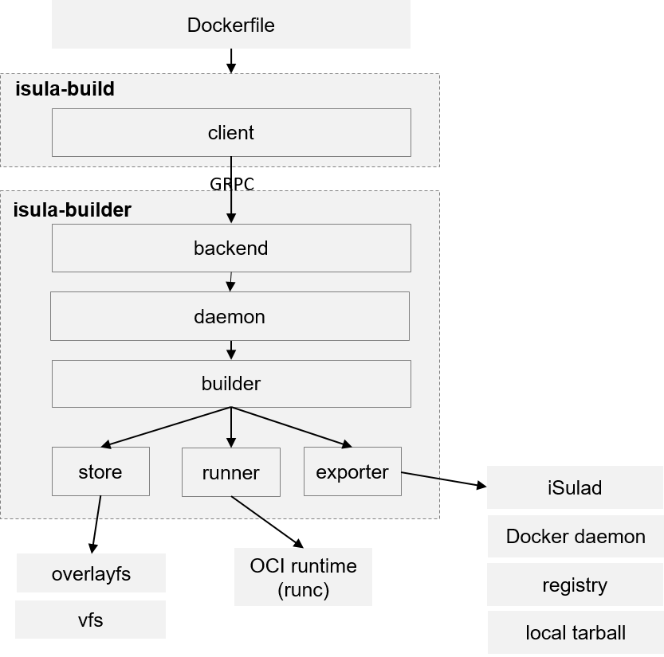

## iSula-Build design

iSula-Build is a new container image building tool. It aims to provide smart loading, secure container image building for iSulad.

It reads Dockerfile as input, builds and outputs the images for iSulad, and could be docker compatible.

It's architecture is like:

Within it:
- isula-build is the client, accepts the command-line input and converts to GRPC requests to isula-builder
- isula-builder is the daemon, the main builder
  - backend accepts the external GRPC requests from isula-build or third-party clients for daemon
  - daemon manages subcomponents, image building tasks and doing GC
  - builder parses Dockerfile and building images
  - store manages underlaying union-fs storage, such as overlayfs and VFS
  - runner executing OCI runtimes for RUN command
  - exporter exports built images to iSulad, registry, local tarball and so on

