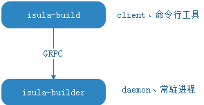

# 容器镜像构建

* [概述](#概述)
* [安装](#安装)
    * [环境准备](#环境准备)
        * [安装isula-build](#安装isula-build)
* [配置与管理服务](#配置与管理服务)
    * [配置服务](#配置服务)
    * [管理服务](#管理服务)
        * [通过 systemd 管理（推荐方式）](#通过-systemd-管理推荐方式)
        * [直接运行 isula-build 服务端](#直接运行-isula-build-服务端)
* [使用指南](#使用指南)
    * [前提条件](#前提条件)
    * [总体说明](#总体说明)
    * [ctr-img: 容器镜像管理](#ctr-img-容器镜像管理)
        * [build: 容器镜像构建](#build-容器镜像构建)
        * [image: 查看本地持久化构建镜像](#image-查看本地持久化构建镜像)
        * [import: 导入容器基础镜像](#import-导入容器基础镜像)
        * [load: 导入层叠镜像](#load-导入层叠镜像)
        * [rm: 删除本地持久化镜像](#rm-删除本地持久化镜像)
        * [save: 导出层叠镜像](#save-导出层叠镜像)
        * [tag: 给本地持久化镜像打标签](#tag-给本地持久化镜像打标签)
        * [pull: 拉取镜像到本地](#pull-拉取镜像到本地)
        * [push: 将本地镜像推送到远程仓库](#push-将本地镜像推送到远程仓库)
    * [info: 查看运行环境与系统信息](#info-查看运行环境与系统信息)
    * [login: 登录远端镜像仓库](#login-登录远端镜像仓库)
    * [logout: 退出远端镜像仓库](#logout-退出远端镜像仓库)
    * [version: 版本查询](#version-版本查询)
    * [manifest: manifest列表管理（实验特性）](#manifest-manifest列表管理)
        * [create: manifest列表创建](#create-manifest列表创建)
        * [annotate: manifest列表更新](#annotate-manifest列表更新)
        * [inspect: manifest列表查询](#inspect-manifest列表查询)
        * [push: 将manifest列表推送到远程仓库](#push-将manifest列表推送到远程仓库)
* [直接集成容器引擎](#直接集成容器引擎)
    * [与iSulad集成](#与isulad集成)
    * [与Docker集成](#与docker集成)
* [使用注意事项](#使用注意事项)
    * [约束和限制](#约束和限制)
    * [与“docker build”差异](#与docker-build差异)
* [附录](#附录)
    * [命令行参数说明](#命令行参数说明)
    * [通信矩阵](#通信矩阵)
    * [文件与权限](#文件与权限)

## 概述

isula-build是iSula容器团队推出的容器镜像构建工具，支持通过Dockerfile文件快速构建容器镜像。

isula-build采用服务端/客户端模式，其中，isula-build为客户端，提供了一组命令行工具，用于镜像构建及管理等；isula-builder为服务端，用于处理客户端管理请求，作为守护进程常驻后台。



> **说明**：
>
> - isula-build当前仅支持Docker镜像。

## 安装

### 环境准备

为了确保isula-build成功安装，需满足以下软件硬件要求。

- 支持的机器架构：x86_64 和 AArch64
- 支持的操作系统：openEuler
- 用户具有root权限。

#### 安装isula-build

使用isula-build构建容器镜像，需要先安装以下软件包。

**（推荐）方法一：使用yum安装**

1. 配置openEuler yum源。

2. 使用root权限，登录目标服务器，安装isula-build。

   ```
   sudo yum install -y isula-build
   ```

**方法二：使用rpm包安装**

1. 从openEuler yum源中获取isula-build对应安装包isula-build-\*.rpm。例如isula-build-0.9.3-4.oe1.x86_64.rpm。

2. 将获取的rpm软件包上传至目标服务器的任一目录，例如 /home/。

3. 使用root权限，登录目标服务器，参考如下命令安装isula-build。

   ```
   sudo rpm -ivh /home/isula-build-*.rpm
   ```

> **说明：**
>
> - 安装完成后，需要手工启动isula-build服务。启动请参见"管理服务"。

## 配置与管理服务

### 配置服务

在安装完 isula-build 软件包之后，systemd 管理服务会以 isula-build 软件包自带的 isula-build 服务端默认配置启动 isula-build 服务。如果 isula-build 服务端的默认配置文件不能满足用户的需求，可以参考如下介绍进行定制化配置。需要注意的是，修改完默认配置之后，需要重启 isula-build 服务端使新配置生效，具体操作可参考下一章节。

目前 isula-build 服务端包含如下配置文件：

- /etc/isula-build/configuration.toml：isula-builder 总体配置文件，用于设置 isula-builder 日志级别、持久化目录和运行时目录、OCI runtime等。其中各参数含义如下：

| 配置项       | 是否可选 | 配置项含义                                                   | 配置项取值                                      |
| ------------ | -------- | ------------------------------------------------------------ | ----------------------------------------------- |
| debug        | 可选     | 设置是否打开debug日志                                        | true：打开debug日志；false：关闭debug日志       |
| loglevel     | 可选     | 设置日志级别                                                 | debug， info，warn，error                       |
| run_root     | 必选     | 设置运行时数据根目录                                         | 运行时数据根目录路径，例如/var/run/isula-build/ |
| data_root    | 必选     | 设置本地持久化目录                                           | 本地持久化目录路径，例如/var/lib/isula-build/   |
| runtime      | 可选     | 设置runtime种类，目前仅支持runc                              | runc                                            |
| group        | 可选     | 设置本地套接字isula_build.sock文件属组使得加入该组的非特权用户可以操作isula-build | isula                                           |
| experimental | 可选     | 设置是否开启实验特性                                         | true：开启实验特性；false：关闭实验特性         |


- /etc/isula-build/storage.toml: 本地持久化存储的配置文件，包含所使用的存储驱动的配置。

| 配置项 | 是否可选 | 配置项含义                     |
| ------ | -------- | ------------------------------ |
| driver | 可选     | 存储驱动类型，目前支持overlay2 |

  更多设置可参考 [containers-storage.conf.5.md](https://github.com/containers/storage/blob/master/docs/containers-storage.conf.5.md)。


- /etc/isula-build/registries.toml : 针对各个镜像仓库的配置文件。

| 配置项              | 是否可选 | 配置项含义                                                   |
| ------------------- | -------- | ------------------------------------------------------------ |
| registries.search   | 可选     | 镜像仓库搜索域，在此list的镜像仓库可以被感知，不在此列的不被感知。 |
| registries.insecure | 可选     | 可访问的不安全镜像仓库地址，在此列表中的镜像仓库将不会通过鉴权，不推荐使用。 |

  更多设置可参考 [containers-registries.conf.5.md](https://github.com/containers/image/blob/master/docs/containers-registries.conf.5.md)。

- /etc/isula-build/policy.json：镜像pull/push策略文件。注：当前不支持对其进行配置

> **说明：**
>
> - isula-build 支持最大 1MiB 的上述配置文件。
> - isula-build 不支持将持久化工作目录 dataroot 配置在内存盘上，比如 tmpfs。
> - isula-build 目前仅支持使用overlay2为底层 graphdriver。
> - 在设置--group参数前，需保证本地OS已经创建了对应的用户组，且非特权用户已经加入该组。重启isula-builder之后即可使该非特权用户使用isula-build功能。同时，为了保持权限一致性，isula-build的配置文件目录/etc/isula-build的数组也会被设置为--group指定的组。

### 管理服务

目前 openEuler 采用 systemd 管理软件服务，isula-build 软件包已经自带了 systemd 的服务文件，用户安装完 isula-build 软件包之后可以直接通过 systemd 工具对它进行服务启停等操作。用户同样可以手动启动 isula-build 服务端软件。需要注意的是，同一个节点上不可以同时启动多个 isula-build 服务端软件。

> **说明：**
>
> - 同一个节点上不可以同时启动多个 isula-build 服务端软件。

#### 通过 systemd 管理（推荐方式）

用户可以通过如下 systemd 的标准指令控制 isula-build 服务的启动、停止、重启等动作：

- 启动 isula-build 服务：

  ```sh
  sudo systemctl start isula-build.service
  ```

- 停止 isula-build 服务：

  ```sh
  sudo systemctl stop isula-build.service
  ```

- 重启 isula-builder 服务：

  ```sh
  sudo systemctl restart isula-build.service
  ```

isula-build 软件包安装的 systemd 服务文件保存在 `/usr/lib/systemd/system/isula-build.service`。如果用户需要修改 isula-build 服务的 systemd 配置，可以修改该文件，执行如下命令使配置生效，之后再根据上面提到的 systemd 管理指令重启 isula-build 服务

```sh
sudo systemctl daemon-reload
```

#### 直接运行 isula-build 服务端

您也可以通过执行 isula-build 服务端命令（ isula-builder）的方式启动服务。其中，服务端启动配置，可通过isula-builder命令支持的 flags 设置。isula-build 服务端目前支持的 flags 如下：

- -D, --debug: 是否开启调测模式。
- --log-level: 日志级别，支持 “debug”, “info”, “warn” or “error”，默认为 “info”。
- --dataroot: 本地持久化路径，默认为”/var/lib/isula-build/“。
- --runroot: 运行时路径，默认为”/var/run/isula-build/“。
- --storage-driver：底层存储驱动类型。
- --storage-opt: 底层存储驱动配置。
- --group: 设置本地套接字isula_build.sock文件属组使得加入该组的非特权用户可以操作isula-build，默认为“isula”。
- --experimental: 是否开启实验特性，默认为false。

> **说明：**
>
> - 当命令行启动参数中传递了与配置文件相同的配置选项时，优先使用命令行参数启动。

启动 isula-build 服务。例如指定本地持久化路径/var/lib/isula-build，且不开启调试的参考命令如下：

```sh
sudo isula-builder --dataroot "/var/lib/isula-build"
```

## 使用指南

### 前提条件

isula-build 构建 Dockerfile 内的 RUN 指令时依赖可执行文件 runc ，需要 isula-build 的运行环境上预装好 runc。安装方式视用户使用场景而定，如果用户不需要使用完整的 docker-engine 工具链，则可以仅安装 docker-runc rpm包：

```sh
sudo yum install -y docker-runc
```

如果用户需要使用完整的 docker-engine 工具链，则可以安装 docker-engine rpm包，默认包含可执行文件 runc ：

```sh
sudo yum install -y docker-engine
```

> **说明：**
>
> - 用户需保证OCI runtime(runc)可执行文件的安全性，避免被恶意替换。

### 总体说明

isula-build 客户端提供了一系列命令用于构建和管理容器镜像，当前 isula-build 包含的命令行指令如下：

- ctr-img，容器镜像管理。ctr-img又包含如下子命令：
  - build，根据给定dockerfile构建出容器镜像。
  - images，列出本地容器镜像。
  - import，导入容器基础镜像。
  - load，导入层叠镜像。
  - rm，删除本地容器镜像。
  - save，导出层叠镜像至本地磁盘。
  - tag，给本地容器镜像打tag。
  - pull，拉取镜像到本地。
  - push，推送本地镜像到远程仓库。
- info，查看isula-build的运行环境和系统信息。
- login，登录远端容器镜像仓库。
- logout，退出远端容器镜像仓库。
- version，查看isula-build和isula-builder的版本号。
- manifest(实验特性)，管理manifest列表。

> **说明：**
>
> - isula-build completion 和 isula-builder completion 命令用于生成bash命令补全脚本。该命令为命令行框架隐式提供，不会显示在help信息中。
> - isula-build客户端不包含配置文件，当用户需要使用isula-build实验特性时，需要在客户端通过命令`export ISULABUILD_CLI_EXPERIMENTAL=enabled`配置环境变量ISULABUILD_CLI_EXPERIMENTAL来开启实验特性。

以下按照上述维度依次详细介绍这些命令行指令的使用。


### ctr-img: 容器镜像管理

isula-build 将所有容器镜像管理相关命令划分在子命令 `ctr-img` 下，命令原型为：

```
isula-build ctr-img [command]
```

#### build: 容器镜像构建

ctr-img 的子命令 build 用于构建容器镜像，命令原型为：

```
isula-build ctr-img build [flags]
```

其中 build 包含如下 flags：

- --build-arg：string列表，构建过程中需要用到的变量。
- --build-static：KeyValue值，构建二进制一致性。目前包含如下Key值：
   - build-time：string，使用固定时间戳来构建容器镜像；时间戳格式为“YYYY-MM-DD HH-MM-SS”。
- -f, --filename：string，Dockerfile的路径，不指定则是使用当前路径的Dockerfile文件。
- --iidfile：string，输出 image ID 到本地文件。
- -o, --output：string，镜像导出的方式和路径。
- --proxy：布尔值，继承主机侧环境的proxy环境变量（默认为true）。
- --tag：string，设置构建成功的镜像的tag值。
- --cap-add：string列表，构建过程中RUN指令所需要的权限。

**以下为各个 flags 的详解。**

**\--build-arg**

从命令行接受参数作为Dockerfile中的参数，用法：

```sh
$ echo "This is bar file" > bar.txt
$ cat Dockerfile_arg
FROM busybox
ARG foo
ADD ${foo}.txt .
RUN cat ${foo}.txt
$ sudo isula-build ctr-img build --build-arg foo=bar -f Dockerfile_arg
STEP  1: FROM busybox
Getting image source signatures
Copying blob sha256:8f52abd3da461b2c0c11fda7a1b53413f1a92320eb96525ddf92c0b5cde781ad
Copying config sha256:e4db68de4ff27c2adfea0c54bbb73a61a42f5b667c326de4d7d5b19ab71c6a3b
Writing manifest to image destination
Storing signatures
STEP  2: ARG foo
STEP  3: ADD ${foo}.txt .
STEP  4: RUN cat ${foo}.txt
This is bar file
Getting image source signatures
Copying blob sha256:6194458b07fcf01f1483d96cd6c34302ffff7f382bb151a6d023c4e80ba3050a
Copying blob sha256:6bb56e4a46f563b20542171b998cb4556af4745efc9516820eabee7a08b7b869
Copying config sha256:39b62a3342eed40b41a1bcd9cd455d77466550dfa0f0109af7a708c3e895f9a2
Writing manifest to image destination
Storing signatures
Build success with image id: 39b62a3342eed40b41a1bcd9cd455d77466550dfa0f0109af7a708c3e895f9a2
```

**\--build-static**

指定为静态构建，即使用isula-build构建容器镜像时消除所有时间戳和其他构建因素（例如容器ID、hostname等）的差异。最终构建出满足静态要求的容器镜像。

在使用isula-build进行容器镜像构建时，假如给 build 子命令一个固定的时间戳，并在限定如下条件的时候：

- 构建环境前后保持一致。
- 构建Dockerfile前后保持一致。
- 构建产生的中间数据前后保持一致。
- 构建命令相同。
- 第三方库版本一致。

对于容器镜像构建，isula-build支持相同的Dockerfile。如果构建环境相同，则多次构建生成的镜像内容和镜像ID相同。

--build-static接受k=v形式的键值对选项，当前支持的选项有：

- build-time：字符串类型。构建静态镜像的固定时间戳，格式为“YYYY-MM-DD HH-MM-SS”。时间戳影响diff层创建修改时间的文件属性。

  使用示例如下：

  ```sh
  $ sudo isula-build ctr-img build -f Dockerfile --build-static='build-time=2020-05-23 10:55:33' .
  ```

  以此方式，同一环境多次构建出来的容器镜像和镜像ID均会保持一致。

**\--iidfile**

将构建的镜像ID输出到文件，用法：

```
isula-build ctr-img build --iidfile filename
```

例如，将容器镜像ID输出到testfile的参考命令如下：

  ```sh
$ sudo isula-build ctr-img build -f Dockerfile_arg --iidfile testfile
  ```

  查看testfile中的容器镜像ID：

  ```sh
$ cat testfile
76cbeed38a8e716e22b68988a76410eaf83327963c3b29ff648296d5cd15ce7b
  ```

**\-o, --output**

目前 -o, –output 支持如下形式：

- `isulad:image:tag`：将构建成功的镜像直接推送到 iSulad。比如：`-o isulad:busybox:latest`。同时需要注意如下约束：

  - isula-build 和 iSulad 必须在同一个节点上
  - tag必须配置
  - isula-build client端需要将构建成功的镜像暂存成 `/var/tmp/isula-build-tmp-%v.tar` 再导入至 iSulad，用户需要保证 `/var/tmp/` 目录有足够磁盘空间

- `docker-daemon:image:tag`：将构建成功的镜像直接推送到 Docker daemon。比如：`-o docker-daemon:busybox:latest`。同时需要注意如下约束：
- isula-build 和 docker 必须在同一个节点上
  - tag必须配置

- `docker://registry.example.com/repository:tag`：将构建成功的镜像直接推送到远端镜像仓库。比如：`-o docker://localhost:5000/library/busybox:latest`。

- `docker-archive:<path>/<filename>:image:tag`：将构建成功的镜像以Docker image的格式保存至本地。比如：`-o docker-archive:/root/image.tar:busybox:latest`。

除去各个flags之外，build子命令的命令行最后还会接收一个argument，该argument类型是string，意义为context，即该Dockerfile构建环境的上下文。该参数默认值为isula-build被执行的当前路径。该路径会影响 .dockerignore 和 Dockerfile的ADD/COPY指令 所检索的路径。

**\--proxy**

选择构建时RUN指令启动的容器是否从环境上继承proxy相关环境变量”http_proxy”,“https_proxy”,“ftp_proxy”,“no_proxy”,“HTTP_PROXY”,“HTTPS_PROXY”,“FTP_PROXY”,“NO_PROXY”，默认为true。

当用户在Dockerfile配置proxy相关ARG或ENV，将覆盖所继承的环境变量。

注意：若client与daemon不在同一个终端运行，所能继承的环境变量为daemon所在终端的环境变量。

**\--tag**

设置镜像构建成功之后，该镜像在本地磁盘存储时的tag。

**\--cap-add**

添加构建过程中RUN指令所需权限，用法：

```
isula-build ctr-img build --cap-add ${CAP}
```

使用举例：

```sh
$ sudo isula-build ctr-img build --cap-add CAP_SYS_ADMIN --cap-add CAP_SYS_PTRACE -f Dockerfile
```

> **说明：**
>
> - isula-build最大支持并发构建100个容器镜像。
> - isula-build支持Dockerfile最大为1MiB。
> - isula-build支持 .dockerignore 最大为 1MiB。
> - 用户需保证Dockerfile文件的权限为仅当前用户可读写，避免别的用户进行篡改。
> - 构建时，RUN指令会启动容器在容器内进行构建，目前 isula-build 仅支持使用主机网络。
> - isula-build 导出的镜像压缩格式，目前仅支持tar格式。
> - isula-build 在每一个镜像构建stage完成后做一次提交，而不是每执行 Dockerfile的一行就提交一次。
> - isula-build 暂不支持构建缓存。
> - isula-build 仅在构建RUN指令时会启动构建容器。
> - 目前不支持docker镜像格式的history功能。
> - isula-build 的stage name支持以数字开头。
> - isula-build 的stage name最长可为64个字符。
> - isula-build 暂不支持对单次Dockerfile的构建进行资源限制。如有资源限制需求，可通过对 isula-builder 服务端配置资源限额的方式进行限制。
> - isula-build 目前不支持Dockerfile里的ADD指令提供的数据来源是远端url。
> - isula-build 使用docker-archive类型导出的本地tar包未经压缩。如有需求，用户可以手动进行压缩。

#### image: 查看本地持久化构建镜像

可通过images命令查看当前本地持久化存储的镜像：

```sh
$ sudo isula-build ctr-img images
----------------------------------------------  -----------  -----------------  --------------------------  ------------
REPOSITORY                                      TAG          IMAGE ID           CREATED                     SIZE
----------------------------------------------  -----------  -----------------  --------------------------  ------------
localhost:5000/library/alpine                   latest       a24bb4013296       2020-20-19 19:59:197        5.85 MB
<none>                                          <none>       39b62a3342ee       2020-20-38 38:66:387        1.45 MB
----------------------------------------------  -----------  -----------------  --------------------------  ------------
```

> **说明：**
>
> - 通过`isula-build ctr-img images`查看的镜像大小与`docker images`的显示上有一定差异。这是因为统计镜像大小时，isula-build是直接计算每层tar包大小之和，而docker是通过解压tar遍历diff目录计算文件大小之和，因此存在统计上的差异。

#### import: 导入容器基础镜像

openEuler会随版本发布一个容器基础镜像，比如openEuler-docker.x86_64.tar.xz。可以通过`ctr-img import`指令将它导入到 isula-build。

命令原型如下：

```
isula-build ctr-img import [flags]
```

使用举例：

```sh
$ sudo isula-build ctr-img import ./openEuler-docker.x86_64.tar.xz openeuler:20.09
Import success with image id: 7317851cd2ab33263eb293f68efee9d724780251e4e92c0fb76bf5d3c5585e37
$ sudo isula-build ctr-img images
----------------------------------------------  --------------------  -----------------  ------------------------  ------------
REPOSITORY                                      TAG                   IMAGE ID           CREATED                   SIZE
----------------------------------------------  --------------------  -----------------  ------------------------  ------------
openeuler                                       20.09                 7317851cd2ab       2020-08-01 06:25:34       500 MB
----------------------------------------------  --------------------  -----------------  ------------------------  ------------
```

> **说明：**
>
> - isula-build 支持导入最大1GiB的容器基础镜像。

#### load: 导入层叠镜像

层叠镜像指的是通过 docker save 或 isula-build ctr-img save 等指令，将一个构建完成的镜像保存至本地之后，镜像压缩包内是一层一层 layer.tar 的镜像包。可以通过 ctr-img load 指令将它导入至 isula-build。

命令原型如下：

```
isula-build ctr-img load [flags]
```

目前支持的 flags 为：

- -i, --input：本地tar包的路径

使用举例如下：

```sh
$ sudo isula-build ctr-img load -i ubuntu.tar
Getting image source signatures
Copying blob sha256:cf612f747e0fbcc1674f88712b7bc1cd8b91cf0be8f9e9771235169f139d507c
Copying blob sha256:f934e33a54a60630267df295a5c232ceb15b2938ebb0476364192b1537449093
Copying blob sha256:943edb549a8300092a714190dfe633341c0ffb483784c4fdfe884b9019f6a0b4
Copying blob sha256:e7ebc6e16708285bee3917ae12bf8d172ee0d7684a7830751ab9a1c070e7a125
Copying blob sha256:bf6751561805be7d07d66f6acb2a33e99cf0cc0a20f5fd5d94a3c7f8ae55c2a1
Copying blob sha256:c1bd37d01c89de343d68867518b1155cb297d8e03942066ecb44ae8f46b608a3
Copying blob sha256:a84e57b779297b72428fc7308e63d13b4df99140f78565be92fc9dbe03fc6e69
Copying blob sha256:14dd68f4c7e23d6a2363c2320747ab88986dfd43ba0489d139eeac3ac75323b2
Copying blob sha256:a2092d776649ea2301f60265f378a02405539a2a68093b2612792cc65d00d161
Copying blob sha256:879119e879f682c04d0784c9ae7bc6f421e206b95d20b32ce1cb8a49bfdef202
Copying blob sha256:e615448af51b848ecec00caeaffd1e30e8bf5cffd464747d159f80e346b7a150
Copying blob sha256:f610bd1e9ac6aa9326d61713d552eeefef47d2bd49fc16140aa9bf3db38c30a4
Copying blob sha256:bfe0a1336d031bf5ff3ce381e354be7b2bf310574cc0cd1949ad94dda020cd27
Copying blob sha256:f0f15db85788c1260c6aa8ad225823f45c89700781c4c793361ac5fa58d204c7
Copying config sha256:c07ddb44daa97e9e8d2d68316b296cc9343ab5f3d2babc5e6e03b80cd580478e
Writing manifest to image destination
Storing signatures
Loaded image as c07ddb44daa97e9e8d2d68316b296cc9343ab5f3d2babc5e6e03b80cd580478e
```

> **说明：**
>
> - isula-build load命令仅支持导入包含单个层叠镜像的镜像压缩文件。
> - isula-build 支持导入最大50G的容器层叠镜像。

#### rm: 删除本地持久化镜像

可通过rm命令删除当前本地持久化存储的镜像。命令原型为：

```
isula-build ctr-img rm IMAGE [IMAGE...] [FLAGS]
```

目前支持的 flags 为：

- -a, –all：删除所有本地持久化存储的镜像。
- -p, –prune：删除所有没有tag的本地持久化存储的镜像。

使用示例如下：

```sh
$ sudo isula-build ctr-img rm -p
Deleted: sha256:78731c1dde25361f539555edaf8f0b24132085b7cab6ecb90de63d72fa00c01d
Deleted: sha256:eeba1bfe9fca569a894d525ed291bdaef389d28a88c288914c1a9db7261ad12c
```

#### save: 导出层叠镜像

可通过save命令导出层叠镜像到本地磁盘。命令原型如下：

```
isula-build ctr-img save [REPOSITORY:TAG]|imageID -o xx.tar
```

以下示例通过 `image/tag` 的形式将镜像进行导出：

```sh
$ sudo isula-build ctr-img save busybox:latest -o busybox.tar
Getting image source signatures
Copying blob sha256:50644c29ef5a27c9a40c393a73ece2479de78325cae7d762ef3cdc19bf42dd0a
Copying blob sha256:824082a6864774d5527bda0d3c7ebd5ddc349daadf2aa8f5f305b7a2e439806f
Copying blob sha256:5f70bf18a086007016e948b04aed3b82103a36bea41755b6cddfaf10ace3c6ef
Copying config sha256:21c3e96ac411242a0e876af269c0cbe9d071626bdfb7cc79bfa2ddb9f7a82db6
Writing manifest to image destination
Storing signatures
Save success with image: busybox:latest
```

以下示例通过 `ImageID` 的形式将镜像进行导出：

```sh
$ sudo isula-build ctr-img save 21c3e96ac411 -o busybox.tar
Getting image source signatures
Copying blob sha256:50644c29ef5a27c9a40c393a73ece2479de78325cae7d762ef3cdc19bf42dd0a
Copying blob sha256:824082a6864774d5527bda0d3c7ebd5ddc349daadf2aa8f5f305b7a2e439806f
Copying blob sha256:5f70bf18a086007016e948b04aed3b82103a36bea41755b6cddfaf10ace3c6ef
Copying config sha256:21c3e96ac411242a0e876af269c0cbe9d071626bdfb7cc79bfa2ddb9f7a82db6
Writing manifest to image destination
Storing signatures
Save success with image: 21c3e96ac411
```

以下示例导出多个镜像到同一个tarball：
```sh
$ sudo isula-build ctr-img save busybox:latest nginx:latest -o all.tar
Getting image source signatures
Copying blob sha256:eb78099fbf7fdc70c65f286f4edc6659fcda510b3d1cfe1caa6452cc671427bf
Copying blob sha256:29f11c413898c5aad8ed89ad5446e89e439e8cfa217cbb404ef2dbd6e1e8d6a5
Copying blob sha256:af5bd3938f60ece203cd76358d8bde91968e56491daf3030f6415f103de26820
Copying config sha256:b8efb18f159bd948486f18bd8940b56fd2298b438229f5bd2bcf4cedcf037448
Writing manifest to image destination
Storing signatures
Getting image source signatures
Copying blob sha256:e2d6930974a28887b15367769d9666116027c411b7e6c4025f7c850df1e45038
Copying config sha256:a33de3c85292c9e65681c2e19b8298d12087749b71a504a23c576090891eedd6
Writing manifest to image destination
Storing signatures
Save success with image: [busybox:latest nginx:latest]
```

> **说明：**
>
> - save 导出的镜像默认格式为未压缩的tar格式，如有需求，用户可以再save之后手动压缩。
> - 在导出镜像时，需要写明镜像的完整性，格式为IMAGE_NAME:IMAGE_TAG。


#### tag: 给本地持久化镜像打标签

可使用tag命令给本地持久化的容器镜像打tag。命令原型如下：

```
isula-build ctr-img tag <imageID>/<imageName> busybox:latest
```

使用举例：

```sh
$ sudo isula-build ctr-img images
----------------------------------------------  -----------  -----------------  --------------------------  ------------
REPOSITORY                                      TAG          IMAGE ID           CREATED                     SIZE
----------------------------------------------  -----------  -----------------  --------------------------  ------------
alpine                                         latest       a24bb4013296       2020-05-29 21:19:46         5.85 MB
----------------------------------------------  -----------  -----------------  --------------------------  ------------
$ sudo isula-build ctr-img tag a24bb4013296 alpine:v1
$ sudo isula-build ctr-img images
----------------------------------------------  -----------  -----------------  --------------------------  ------------
REPOSITORY                                      TAG          IMAGE ID           CREATED                     SIZE
----------------------------------------------  -----------  -----------------  --------------------------  ------------
alpine                                           latest       a24bb4013296       2020-05-29 21:19:46         5.85 MB
alpine                                           v1           a24bb4013296       2020-05-29 21:19:46         5.85 MB
----------------------------------------------  -----------  -----------------  --------------------------  ------------
```

#### pull: 拉取镜像到本地

可通过pull命令拉取远程镜像仓库中的镜像到本地。命令原型如下：

```
isula-build ctr-img pull REPOSITORY[:TAG]
```

使用示例：

```sh
$ sudo isula-build ctr-img pull example-registry/library/alpine:latest
Getting image source signatures
Copying blob sha256:8f52abd3da461b2c0c11fda7a1b53413f1a92320eb96525ddf92c0b5cde781ad
Copying config sha256:e4db68de4ff27c2adfea0c54bbb73a61a42f5b667c326de4d7d5b19ab71c6a3b
Writing manifest to image destination
Storing signatures
Pull success with image: example-registry/library/alpine:latest
```

#### push: 将本地镜像推送到远程仓库

可通过push命令将本地镜像推送到远程仓库。命令原型如下：

```
isula-build ctr-img push REPOSITORY[:TAG]
```

使用示例：

```sh
$ sudo isula-build ctr-img push example-registry/library/mybusybox:latest
Getting image source signatures
Copying blob sha256:d2421964bad195c959ba147ad21626ccddc73a4f2638664ad1c07bd9df48a675
Copying config sha256:f0b02e9d092d905d0d87a8455a1ae3e9bb47b4aa3dc125125ca5cd10d6441c9f
Writing manifest to image destination
Storing signatures
Push success with image: example-registry/library/mybusybox:latest
```

> **说明：**
>
> - 推送镜像时，需要先登录对应的镜像仓库。


### info: 查看运行环境与系统信息

可以通过“isula-build info”指令查看 isula-build 目前的运行环境与系统信息。命令原型如下：

```
 isula-build info [flags]
```

支持如下Flags：

- -H, --human-readable 布尔值，以常用内存表示格式打印内存信息，使用1000次幂
- -V, --verbose 布尔值，显示运行时内存占用信息

使用示例：

```sh
$ sudo isula-build info -HV
   General:
     MemTotal:     7.63 GB
     MemFree:      757 MB
     SwapTotal:    8.3 GB
     SwapFree:     8.25 GB
     OCI Runtime:  runc
     DataRoot:     /var/lib/isula-build/
     RunRoot:      /var/run/isula-build/
     Builders:     0
     Goroutines:   12
   Store:
     Storage Driver:     overlay
     Backing Filesystem: extfs
   Registry:
     Search Registries:
       oepkgs.net
     Insecure Registries:
       localhost:5000
       oepkgs.net
   Runtime:
	 MemSys:           68.4 MB
     HeapSys:          63.3 MB
     HeapAlloc:        7.41 MB
     MemHeapInUse:     8.98 MB
     MemHeapIdle:      54.4 MB
     MemHeapReleased:  52.1 MB
```

### login: 登录远端镜像仓库

用户可以运行 login 命令来登录远程镜像仓库。命令原型如下：

```
 isula-build login SERVER [FLAGS]
```

目前支持的flag有：

```
 Flags:
   -p, --password-stdin    Read password from stdin
   -u, --username string   Username to access registry
```

通过stdin输入密码。以下示例通过通过管道将creds.txt里的密码传给isula-build的stdin进行输入：

```sh
 $ cat creds.txt | sudo isula-build login -u cooper -p mydockerhub.io
 Login Succeeded
```

通过交互式输入密码：

```sh
 $ sudo isula-build login mydockerhub.io -u cooper
 Password:
 Login Succeeded
```

### logout: 退出远端镜像仓库

用户可以运行 logout 命令来登出远程镜像仓库。命令原型如下：

```
 isula-build logout [SERVER] [FLAGS]
```

目前支持的flag有：

```
 Flags:
   -a, --all   Logout all registries
```

使用示例如下：

```sh
 $ sudo isula-build logout -a
   Removed authentications
```

### version: 版本查询

可通过version命令查看当前版本信息：

```sh
 $ sudo isula-build version
 Client:
   Version:       0.9.4
   Go Version:    go1.13.3
   Git Commit:    0038365c
   Built:         Tue Nov 24 16:32:05 2020
   OS/Arch:       linux/amd64

 Server:
   Version:       0.9.4
   Go Version:    go1.13.3
   Git Commit:    0038365c
   Built:         Tue Nov 24 16:32:05 2020
   OS/Arch:       linux/amd64
```

### manifest: manifest列表管理

manifest列表包含不同系统架构对应的镜像信息，通过使用manifest列表，用户可以在不同的架构中使用相同的manifest（例如openeuler:latest）获取对应架构的镜像，manifest包含create、annotate、inspect和push子命令。
> **说明：**
>
> - manifest为实验特性，使用时需开启客户端和服务端的实验选项，方式详见客户端总体说明和配置服务章节。


#### create: manifest列表创建

manifest的子命令create用于创建manifest列表，命令原型为：

```
isula-build manifest create MANIFEST_LIST MANIFEST [MANIFEST...]
```

用户可以指定manifest列表的名称以及需要加入到列表中的远程镜像，若不指定任何远程镜像，则会创建一个空的manifest列表。

使用示例如下：

```sh
$ sudo isula-build manifest create openeuler localhost:5000/openeuler_x86:latest localhost:5000/openeuler_aarch64:latest
```

#### annotate: manifest列表更新

manifest的子命令annotate用于更新manifest列表，命令原型为：

```
isula-build manifest annotate MANIFEST_LIST MANIFEST [flags]
```

用户可以指定需要更新的manifest列表以及其中的镜像，通过flags指定需要更新的选项，此命令也可用于添加新的镜像到列表中。

其中annotate包含如下flags：

- --arch： string，重写镜像适用架构
- --os： string，重写镜像适用系统
- --os-features： string列表，指定镜像需要的OS特性，很少使用
- --variant： string，指定列表中记录镜像的变量

使用示例如下：

```sh
$ sudo isula-build manifest annotate --os linux --arch arm64 openeuler:latest localhost:5000/openeuler_aarch64:latest
```

#### inspect: manifest列表查询

manifest子命令inspect用于查询manifest列表信息，命令原型为：

```
isula-build manifest inspect MANIFEST_LIST
```

使用示例如下：

```sh
$ sudo isula-build manifest inspect openeuler:latest
{
    "schemaVersion": 2,
    "mediaType": "application/vnd.docker.distribution.manifest.list.v2+json",
    "manifests": [
        {
            "mediaType": "application/vnd.docker.distribution.manifest.v2+json",
            "size": 527,
            "digest": "sha256:bf510723d2cd2d4e3f5ce7e93bf1e52c8fd76831995ac3bd3f90ecc866643aff",
            "platform": {
                "architecture": "amd64",
                "os": "linux"
            }
        },
        {
            "mediaType": "application/vnd.docker.distribution.manifest.v2+json",
            "size": 527,
            "digest": "sha256:f814888b4bb6149bd39ba8375a1932fb15071b4dbffc7f76c7b602b06abbb820",
            "platform": {
                "architecture": "arm64",
                "os": "linux"
            }
        }
    ]
}
```

#### push: 将manifest列表推送到远程仓库

manifest子命令push用于将manifest列表推送到远程仓库，命令原型为：

```
isula-build manifest push MANIFEST_LIST DESTINATION
```

使用示例如下：

```sh
$ sudo isula-build manifest push openeuler:latest localhost:5000/openeuler:latest
```

## 直接集成容器引擎

isula-build可以与iSulad和docker集成，将构建好的容器镜像导入到容器引擎的本地存储中。

### 与iSulad集成

支持将构建成功的镜像直接导出到iSulad。

命令行举例：

```sh
$ sudo isula-build ctr-img build -f Dockerfile -o isulad:busybox:2.0
```

通过在-o参数中指定iSulad，将构建好的容器镜像导出到iSulad，可以通过isula images查询：

```sh
$ sudo isula images
isula images
REPOSITORY                     TAG        IMAGE ID             CREATED              SIZE
busybox                        2.0        2d414a5cad6d         2020-08-01 06:41:36  5.577 MB
```

> **说明：**
>
> - 要求isula-build和iSulad在同一节点。
> - 直接导出镜像到iSulad时，isula-build client端需要将构建成功的镜像暂存成 `/var/lib/isula-build/tmp/[buildid]/isula-build-tmp-%v.tar` 再导入至 iSulad，用户需要保证 /var/lib/isula-build/tmp/ 目录有足够磁盘空间；同时如果在导出过程中 isula-build client进程被KILL或Ctrl+C终止，需要依赖用户手动清理 `/var/lib/isula-build/tmp/[buildid]/isula-build-tmp-%v.tar` 文件。

### 与Docker集成

支持将构建成功的镜像直接导出到Docker daemon。

命令行举例：

```sh
$ sudo isula-build ctr-img build -f Dockerfile -o docker-daemon:busybox:2.0
```

通过在-o参数中指定docker-daemon，将构建好的容器镜像导出到docker, 可以通过docker images查询。

```sh
$ sudo docker images
REPOSITORY                                          TAG                 IMAGE ID            CREATED             SIZE
busybox                                             2.0                 2d414a5cad6d        2 months ago        5.22MB
```

> **说明：**
>
> - 要求isula-build和Docker在同一节点。

## 使用注意事项
本章节主要介绍在使用isula-build构建镜像时相关的约束和限制，以及与docker build的差异。

### 约束和限制
1. 当导出镜像到[`iSulad`](https://gitee.com/openeuler/iSulad/blob/master/README.md)时，镜像必须指明tag。
2. 因为isula-builder运行`RUN`指令时，需要调用系统中的oci 运行时（如`runc`），用户需要保证该运行时的安全性，不受篡改。
3. `DataRoot`不能设置在内存盘上（tmpfs）。
4. `Overlay2`是目前isula-builder唯一支持的存储驱动。
5. `Docker`镜像是目前唯一支持的镜像格式，未来即将支持`oci`格式镜像。
6. `Dockerfile`文件权限强烈建议设置为**0600**以防止恶意篡改。
7. `RUN`命令中目前只支持主机侧网络（host network）。
8. 当导出镜像到本地tar包时，目前只支持保存为`tar`格式。
9. 当使用`import`功能导入基础镜像时，最大支持**1G**。

### 与“docker build”差异
`isula-build`兼容[Docker镜像格式规范](https://docs.docker.com/engine/reference/builder)，但仍然和`docker build`存在一些差异：
1. 支持镜像压缩，即对每个`stage`进行提交而非每一行。
2. 目前不支持构建缓存。
3. 只有`RUN`指令会运行容器进行构建。
4. 目前不支持查询镜像构建历史。
5. `Stage`名称可以用数字开头。
6. `Stage`名称最大长度为64。
7. `ADD`命令不支持远端URL格式。
8. 暂不支持对单次构建进行资源限额，可采取对isula-builder配置资源限额的方式进行限制。
9. 统计镜像大小时，isula-build是直接计算每层tar包大小之和，而docker是通过解压tar遍历diff目录计算文件大小之和，因此通过`isula-build ctr-img images`查看的镜像大小与`docker images`的显示上有一定差异。
10. 操作时的镜像名称需要明确，格式为IMAGE_NAME:IMAGE_TAG。例如 busybox:latest, 其中latest不可省略。

## 附录

### 命令行参数说明

**表1** ctr-img build 命令参数列表

| **命令**      | **参数**       | **说明**                                                     |
| ------------- | -------------- | ------------------------------------------------------------ |
| ctr-img build | --build-arg    | string列表，构建过程中需要用到的变量                         |
|               | --build-static | KV值，构建二进制一致性。目前包含如下K值：- build-time：string，使用固定时间戳来构建容器镜像；时间戳格式为“YYYY-MM-DD HH-MM-SS” |
|               | -f, --filename | string，Dockerfile的路径，不指定则是使用当前路径的Dockerfile文件 |
|               | --iidfile      | string，输出 image ID 到本地文件                             |
|               | -o, --output   | string，镜像导出的方式和路径                                 |
|               | --proxy        | 布尔值，继承主机侧环境的proxy环境变量（默认为true）          |
|               | --tag          | string，给构建的镜像添加tag                                  |
|               | --cap-add      | string列表，构建过程中RUN指令所需要的权限                    |

**表2** ctr-img load 命令参数列表

| **命令**     | **参数**    | **说明**                          |
| ------------ | ----------- | --------------------------------- |
| ctr-img load | -i, --input | string，需要导入的本地tar包的路径 |

**表3** ctr-img rm 命令参数列表

| **命令**   | **参数**    | **说明**                                      |
| ---------- | ----------- | --------------------------------------------- |
| ctr-img rm | -a, --all   | 布尔值，删除所有本地持久化存储的镜像          |
|            | -p, --prune | 布尔值，删除所有没有tag的本地持久化存储的镜像 |

**表4** ctr-img save 命令参数列表

| **命令**     | **参数**     | **说明**                           |
| ------------ | ------------ | ---------------------------------- |
| ctr-img save | -o, --output | string，镜像导出后在本地的存储路径 |

**表5** login 命令参数列表

| **命令** | **参数**             | **说明**                                                |
| -------- | -------------------- | ------------------------------------------------------- |
| login    | -p, --password-stdin | 布尔值，是否通过stdin读入密码；或采用交互式界面输入密码 |
|          | -u, --username       | string，登陆镜像仓库所使用的用户名                      |

**表6** logout 命令参数列表

| **命令** | **参数**  | **说明**                             |
| -------- | --------- | ------------------------------------ |
| logout   | -a, --all | 布尔值，是否登出所有已登陆的镜像仓库 |

**表7** manifest annotate命令参数列表

| **命令**          | **说明**      | **参数**                                   |
| ----------------- | ------------- | ------------------------------------------ |
| manifest annotate | --arch        | string，重写镜像适用架构                   |
|                   | --os          | string，重写镜像适用系统                   |
|                   | --os-features | string列表，指定镜像需要的OS特性，很少使用 |
|                   | --variant     | string，指定列表中记录镜像的变量           |

### 通信矩阵

isula-build两个组件进程之间通过unix socket套接字文件进行通信，无端口通信。

### 文件与权限

- isula-build 所有的操作均需要使用 root 权限。如需使用非特权用户操作，则需要配置--group参数

- isula-build 运行涉及文件权限如下表所示：

| **文件路径**                                | **文件/文件夹权限** | **说明**                                                     |
| ------------------------------------------- | ------------------- | ------------------------------------------------------------ |
| /usr/bin/isula-build                        | 551                 | 命令行工具二进制文件。                                       |
| /usr/bin/isula-builder                      | 550                 | 服务端isula-builder进程二进制文件。                          |
| /usr/lib/systemd/system/isula-build.service | 640                 | systemd配置文件，用于管理isula-build服务。                   |
| /etc/isula-build                            | 650                 | isula-builder 配置文件根目录                                 |
| /etc/isula-build/configuration.toml         | 600                 | isula-builder 总配置文件，包含设置 isula-builder 日志级别、持久化目录和运行时目录、OCI runtime等。 |
| /etc/isula-build/policy.json                | 600                 | 签名验证策略文件的语法文件。                                 |
| /etc/isula-build/registries.toml            | 600                 | 针对各个镜像仓库的配置文件，含可用的镜像仓库列表、镜像仓库黑名单。 |
| /etc/isula-build/storage.toml               | 600                 | 本地持久化存储的配置文件，包含所使用的存储驱动的配置。       |
| /etc/isula-build/isula-build.pub            | 444                 | 非对称加密公钥文件                                           |
| /var/run/isula_build.sock                   | 660                 | 服务端isula-builder的本地套接字。                            |
| /var/lib/isula-build                        | 700                 | 本地持久化目录。                                             |
| /var/run/isula-build                        | 700                 | 本地运行时目录。                                             |
| /var/lib/isula-build/tmp/[buildid]/isula-build-tmp-*.tar              | 644                 | 镜像导出至iSulad时的本地暂存目录。                           |
